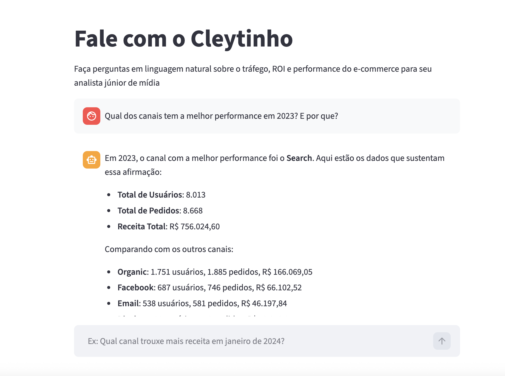

# Agente de IA para Análise de Mídia | Case Técnico Monks

Um agente autônomo que atua como analista júnior de mídia: recebe perguntas em linguagem natural sobre tráfego e receita, decide quais dados precisa, consulta o BigQuery e devolve insights acionáveis (não apenas números brutos).

---

## Arquitetura

O agente opera em um **loop ReAct** (Raciocinar → Agir → Observar) orquestrado pelo LangGraph.

A decisão central de design foi manter a LLM responsável apenas pelo raciocínio e pela linguagem, delegando todo o acesso a dados para ferramentas Python tipadas. Isso evita o erro comum de empurrar resultados SQL direto no prompt e torcer para o modelo interpretá-los corretamente

A arquitetura segue o padrão **LLM-as-Controller**, onde o modelo decide quais ferramentas utilizar enquanto a execução das operações ocorre em código determinístico.

```
Pergunta do usuário
        │
        ▼
  FastAPI /chat
        │
        ▼
  Agente LangGraph  ──── decide ────►  tool_get_traffic_volume
   (gpt-4o-mini)                           └─ COUNT em users, filtrado por
        │                                      traffic_source + intervalo de datas
        │            ──── decide ────►  tool_get_channel_performance
        │                                   └─ JOIN users + orders + order_items
        │                                      (exclui pedidos cancelados/devolvidos)
        ▼
  Resposta analítica em linguagem natural
```

### Por que LangGraph em vez de LangChain puro?

O LangGraph modela o agente como uma máquina de estados explícita, tornando o loop de tool calling inspecionável e fácil de evoluir. Adicionar uma nova ferramenta ou um desvio condicional (por exemplo, "se dados de receita estiverem ausentes, usar só volume de tráfego") é uma aresta no grafo, não um callback enterrado no meio do código.

### Ferramentas

| Ferramenta                     | Quando é acionada                                 | Query executada                                                             |
| ------------------------------ | ------------------------------------------------- | --------------------------------------------------------------------------- |
| `tool_get_traffic_volume`      | Perguntas sobre volume de usuários, topo de funil | `COUNT` em `users`, parametrizado por `traffic_source` e data               |
| `tool_get_channel_performance` | ROI, receita, ranking de canais                   | `JOIN users + orders + order_items`, filtra status `cancelled` e `returned` |

Ambas as ferramentas extraem o intervalo de datas diretamente da pergunta do usuário (via LLM) e os passam como parâmetros para o BigQuery, sem interpolação de strings, sem risco de SQL Injection.

---

## Estrutura do Projeto

```
.
├── main.py                   # App FastAPI, rotas e tipagem Pydantic
├── agent/
│   ├── bot.py                # Definição do LangGraph e Persona do agente
│   └── tools.py              # Ferramentas expostas para a IA (@tool)
├── database/
│   └── bigquery_client.py    # Conexão GCP e queries SQL parametrizadas
├── requirements.txt          # Dependências do projeto
├── .env                      # Variáveis de ambiente (ignorado no git)
└── .env.example              # Exemplo de variáveis de ambiente
```

---

## Interface do Agente (Cleytinho)



*(Interface construída em Streamlit consumindo a API do LangGraph)*


## Setup

**Pré-requisitos:** Python 3.10+, uma conta no GCP com acesso de leitura ao BigQuery (o nível gratuito é suficiente) e uma API Key da OpenAI.

### 1. Clonar e instalar dependências

```bash
git clone https://github.com/taisbronca/case_monks.git
cd case_monks
python3 -m venv venv && source venv/bin/activate  # Windows: venv\Scripts\activate
pip install -r requirements.txt
```

### 2. Credenciais

Coloque o arquivo JSON da sua conta de serviço do GCP na raiz do projeto (ex: `gcp-key.json`).
Crie o arquivo `.env` a partir do exemplo incluído no repositório:

```bash
cp .env.example .env
```

Preencha o `.env`:

```
GOOGLE_APPLICATION_CREDENTIALS="./gcp-key.json"
OPENAI_API_KEY="sk-..."
```

A conta de serviço precisa das permissões `roles/bigquery.user` e `roles/bigquery.dataViewer` no projeto `bigquery-public-data`.

### 3. Executar a Aplicação

A arquitetura possui dois serviços que devem rodar simultaneamente: a API (Backend) e a Interface Visual (Frontend).

**Terminal 1 (Backend - FastAPI):**
Inicie o servidor principal, que processará a IA e conectará ao banco de dados:

```bash
uvicorn main:app --reload
```

A API estará rodando em http://127.0.0.1:8000 (com documentação interativa em /docs).

**Terminal 2 (Frontend - Streamlit):**
A interface foi construída em Streamlit para demonstrar rapidamente o valor do agente em um contexto próximo ao de produto, permitindo que analistas interajam com o sistema sem precisar acessar diretamente a API.

Abra uma nova aba de terminal, ative o ambiente virtual (source venv/bin/activate) e rode a interface gráfica do chat:

```bash
streamlit run frontend.py
```

A interface do Agente abrirá automaticamente no seu navegador em http://localhost:8501.

## Exemplos de Uso

Você pode interagir com o Agente de duas formas:

Opção A: Pela Interface Gráfica (Recomendado)
Acesse http://localhost:8501 e digite suas perguntas em linguagem natural diretamente no chat.

Opção B: Via API (cURL ou Swagger)
Faça uma requisição POST para a rota /chat contendo a pergunta no corpo (body):

```bash
curl -X POST http://127.0.0.1:8000/chat \
  -H "Content-Type: application/json" \
  -d '{"pergunta": "Qual foi a performance de receita dos canais de mídia em janeiro de 2024?"}'
```

Como o Agente processa:
Ao receber a pergunta, o agente vai: extrair o período, acionar a ferramenta tool_get_channel_performance, cruzar as três tabelas no BigQuery de forma segura e retornar uma análise ranqueada com receita e volume de pedidos por canal.

Outros exemplos de perguntas que o agente responde:

- "Como foi o volume de usuários vindos de Search no último trimestre?"
- "Qual canal tem melhor ROI e por quê?"
- "Compare o desempenho de Facebook e Email em 2023."

---

## Dataset

Utiliza o dataset público do BigQuery `bigquery-public-data.thelook_ecommerce`. A coluna `traffic_source` da tabela `users` é tratada como proxy de canal de mídia (Search, Organic, Facebook, Email, Display).

---

## Limitações do MVP

Este MVP foi construído para demonstrar a arquitetura de agentes com tool calling.

Possíveis evoluções:

- Adicionar cache de queries para reduzir custo de BigQuery
- Suporte a múltiplas métricas (CAC, LTV, conversão)
- Uso de Vector DB para memória analítica
- Deploy serverless em Cloud Run

---
## Próximos Passos

Se evoluído para produção, o agente poderia:

- Integrar diretamente com APIs de mídia (Google Ads, Meta Ads)
- Executar análises automáticas diárias
- Gerar alertas de performance
- Criar relatórios automáticos para gestores